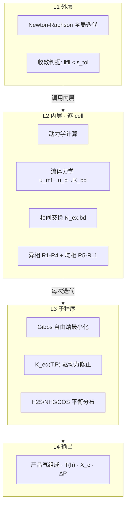
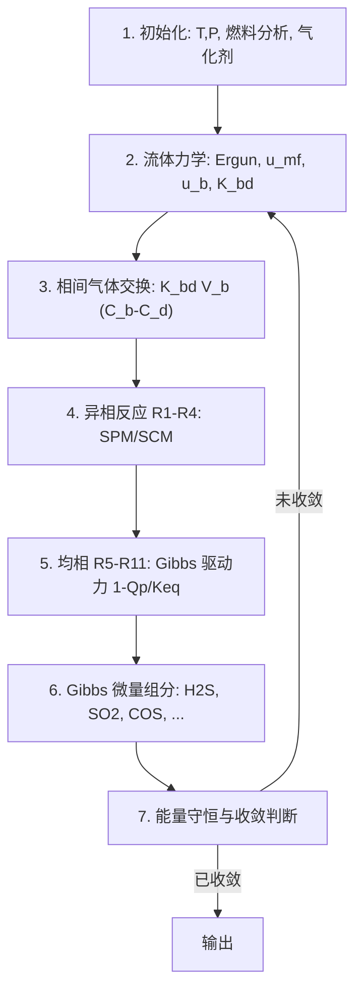
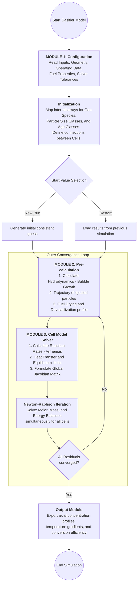
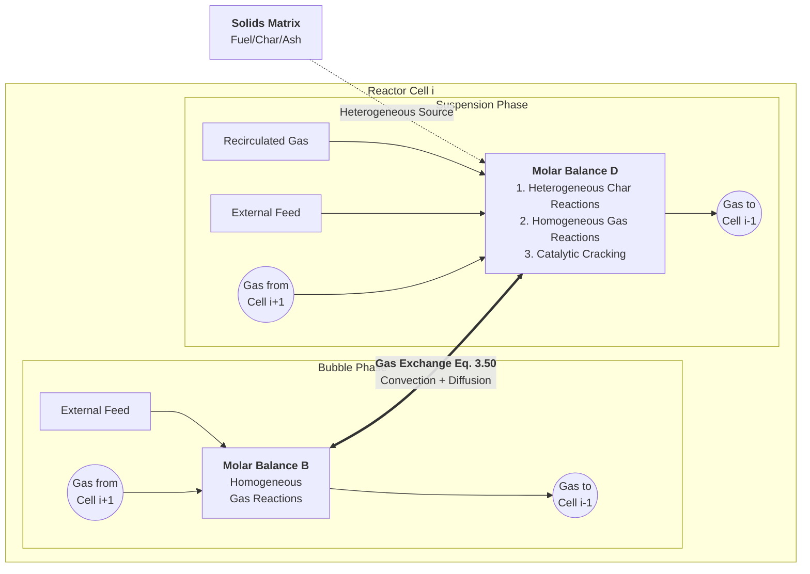
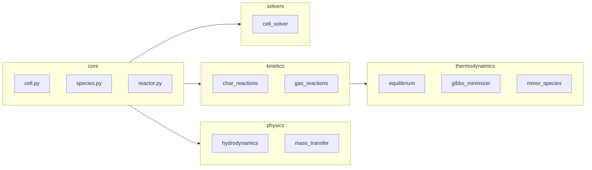

# BFB Gasifier 1D

**鼓泡流化床气化炉一维稳态动力学模型** · 基于 Hamel & Krumm (2001)

[](docs/BFB_TechSpec_v11.md)

---

## 概述

本项目实现鼓泡流化床（BFB）气化炉的一维稳态动力学模型。截至 2026-03-21，已完成 **Phase 1-6** 的全部开发与物理标定。模型不仅在数值上实现了稳定收敛（通过残差归一化与反应项预叠加），且在 **HTW Wesseling (Table 2 LU)** 工况下达到了极高的对标精度：
*   **出口温度**：偏差 **0.64%** (模拟 1093 K vs 实验 1120 K)
*   **出口 CO2**：偏差 **6.80%** (模拟 11.75% vs 实验 11%)
*   **碳转化率**：偏差 **5.26%** (模拟 100% vs 实验 95%)

---

## 核心特性

-   **物理严谨性**：严格执行 SI 单位制，遵循 Hamel (1999) 的 R1-R11 反应网络。
-   **数值鲁棒性**：
    -   **残差归一化**：解决能量与组分方程间的量级差异。
    -   **供应限制动力学**：自动防止反应物过耗导致的数值爆炸。
    -   **Gauss-Seidel 扫描 + 反应项预叠加**：有效打破零浓度初值陷阱。
-   **工业级 Web 界面**：基于 Streamlit 构建的交互式仪表盘，支持实时参数调节（热损失、循环倍率等）与深度动力学诊断。

---

## 安装与运行

### 安装

```bash
cd bfb-gasifier
pip install -r requirements.txt
```

### 运行可视化界面 (Phase 6.2)

```bash
streamlit run app.py
```
**功能亮点**：
-   **工况一键加载**：内置 HTW、VTT 等多个文献标杆工况。
-   **轴向剖面诊断**：实时绘制温度、组分、$O_2$ 消耗及炭消耗速率曲线。
-   **多维度 Parity Plot**：自动对比计算值与实验值的偏差。

---

## 验证与标定记录

详细的收敛经验与物理参数修正记录见：
*   [`docs/convergence_and_calibration_report.md`](docs/convergence_and_calibration_report.md)
*   [`docs/solver_audit_and_stability_report.md`](docs/solver_audit_and_stability_report.md)

---

## 模型架构

## 模型架构

### 求解器层级



| 层级 | 名称 | 说明 |
|------|------|------|
| **L1** | Newton-Raphson 全局迭代 | 收敛判据：所有 cell 的摩尔守恒残差 ‖f‖ < ε_tol |
| **L2** | 动力学计算（逐 cell） | 流体力学 → 相间交换 → 异相 R1–R4 → 均相 R5–R11 |
| **L3** | Gibbs 自由焓最小化 | K_eq(T,P) 驱动力修正；(H₂S, NH₃, COS) 平衡分布 |
| **L4** | 输出 | 产品气组成、T(h)、X_c、ΔP |

**核心耦合机制**：动力学决定碳转化“走多快”；Gibbs 决定气体“最终形态”。

$$R_{net} = R_{kinetic} \times (1 - Q_p/K_{eq})$$

---

### 两相 Cell 结构


每个 cell 按两相理论划分为：

| 相 | 介质 | 反应 | 流速 |
|----|------|------|------|
| **气泡相** | 纯气体，无固体 | 均相 R5–R11 | u_b（快） |
| **悬浮相** | 气体 + 全部固体 | 均相 + 异相 R1–R11 | u_mf（最小流化） |

相间传质：$\dot{N}_{ex,bd} = K_{bd} \cdot V_b \cdot (C_b - C_d)$（Eq. 1-1）

---

### 逐步计算流程



1. **初始化** — T, P，燃料元素分析，气化剂流量
2. **流体力学** — Ergun → u_mf；Hilligardt → u_b, d_b(h), ε_b；Sit & Grace → K_bd
3. **相间气体交换** — K_bd · V_b · (C_b − C_d)
4. **异相反应 R1–R4** — 炭燃烧/气化（SPM/SCM 模型）
5. **均相反应 R5–R11** — Gibbs 驱动力修正 (1 − Q_p/K_eq)
6. **微量组分 Gibbs 最小化** — H₂S, SO₂, COS, NH₃, HCN, NO 平衡分布
7. **能量守恒 + 收敛判断** — 更新 T，返回步骤 2 或输出

---

### Hamel (1999) 原文图示：程序结构（Bild 2.2）与单格摩尔守恒（Bild 2.3）

下列流程图由论文 **Bild 2.2（p. 17）**、**Bild 2.3（p. 18）** 数字化并译为可编辑 **Mermaid** 语法，可在支持 Mermaid 的 Markdown 预览或 [Mermaid Live Editor](https://mermaid.live) 中渲染。

#### Bild 2.2 — 程序结构（模块 1→2→3 与外层收敛）



#### Bild 2.3 — 单格内组分 $j$ 的摩尔守恒与两相耦合



**实现要点（与 `src/` 对照）**

1. **外层反馈（Bild 2.2）**：干燥/热解速率（Module 2）依赖局部温度，温度在 Module 3 / Newton 收敛后才更新 → 对应代码中 **Vorabrechnung（`compute_vorabrechnung`）与扫描或全局 NR 的外层迭代**。
2. **相间交换（Bild 2.3，Eq. 3.50）**：$K_{bd}$ 驱动的气泡–悬浮传质在守恒方程中为一相源、另一相等价汇 → 见 **`physics/mass_transfer.py`** 与 **`cell.py`** 中 $\dot{N}_{ex,bd}$ 项。
3. **Newton–Raphson**：论文强调块三对角 / 全局联立；本仓库 **`solver="global_nr"`** 使用全局残差 + 有限差分 Jacobian（`global_nr_solver.py`），**默认 `gauss_seidel`** 则为逐格 `fsolve` + 外迭代。

更细的 Fortran/Python 对照见 [`docs/hamel_dissertation_vs_python_architecture.md`](docs/hamel_dissertation_vs_python_architecture.md)。

---

## 项目结构



```
bfb-gasifier/
├── src/
│   ├── core/           # 基础数据结构
│   │   ├── cell.py     # Cell 单元计算
│   │   ├── species.py  # 物种与热力学数据
│   │   └── reactor.py  # 反应器离散
│   ├── physics/        # 流体力学
│   │   ├── minimum_fluidization.py  # Ergun, u_mf
│   │   ├── bubble_dynamics.py       # u_b, d_b, ε_b
│   │   ├── mass_transfer.py         # K_bd
│   │   └── ...
│   ├── kinetics/       # 反应动力学
│   │   ├── char_reactions.py   # R1–R4 异相炭反应
│   │   ├── gas_reactions.py   # R5–R11 均相气相反应
│   │   └── ...
│   ├── thermodynamics/ # 热力学（v11 新增）
│   │   ├── equilibrium.py  # K_eq, Q_p, 驱动力
│   │   ├── gibbs_minimizer.py  # 附录 A1 Gibbs 最小化
│   │   └── minor_species.py   # H₂S, SO₂, COS, NH₃, HCN, NO
│   └── solvers/        # 求解器（单 cell fsolve；多 cell 扫描见 core/reactor.py）
│       └── cell_solver.py
├── docs/
│   ├── BFB_ModelArchitecture.html  # 模型架构可视化
│   ├── BFB_TechSpec_v11.md         # 技术说明书
│   └── gibbs_kinetics_coupling.md  # Gibbs–动力学耦合说明
├── data/
│   ├── validation_cases.json       # 验证工况主数据（Table 2 LU ↔ CASE_HTW_WESSELING_1）
│   └── test_cases.json             # 兼容：扁平 CASE_LU，与上键等价；**改工况以 validation_cases.json 为准**
├── tests/
│   ├── sanity_checks.py            # 11 项 sanity 检查
│   └── test_thermodynamics.py      # 热力学单元测试
├── app.py              # Streamlit 可视化界面
└── specs/              # 规格文档
```

---

## 远程仓库与首次推送

- **GitHub**：<https://github.com/dachou5224/bfb-gasifier>
- 本目录宜作为**独立仓库**根目录使用（勿与上级 `AI-projects`  monorepo 混用同一 `.git`，以免误提交其它项目）。

在 `bfb-gasifier/` 下首次关联并推送（示例）：

```bash
cd bfb-gasifier
git init
git branch -M main
git remote add origin https://github.com/dachou5224/bfb-gasifier.git
git add .
git status   # 确认仅有本项目文件
git commit -m "Initial commit: BFB gasifier 1D model"
git push -u origin main
```

若远程已有空仓库的默认分支名为 `main`，上述即可。需 **SSH** 时将 `remote add` 改为 `git@github.com:dachou5224/bfb-gasifier.git`。

---

## 安装与运行

### 环境要求

- Python ≥ 3.8
- numpy ≥ 1.20
- plotly ≥ 5.0

### 安装

```bash
cd bfb-gasifier
pip install -e .
# 或使用虚拟环境
python -m venv venv
source venv/bin/activate  # Windows: venv\Scripts\activate
pip install -e .
```

### 运行 Web 界面

```bash
streamlit run app.py
```

### 运行测试

**数量级门控（必跑）**：每次修订 `src/`、`tests/` 或与本模型核心逻辑相关的 `specs/`、`docs/` 后，应运行：

```bash
cd bfb-gasifier
python3 tests/sanity_checks.py
```

通过标准为终端输出 **`ALL … SANITY CHECKS PASSED`**（含流体力学、动力学与干燥/热解门控）。自动化助手/CI 可在**后台**执行该命令，无需每次向操作者确认。

**气化剂进料**：`ReactorConfig` 在设置 **`ER`**（当量比）、**`primary_agent`**（如 `air_steam` / `o2_steam`）及燃料元素分析后，由 **`src/core/feed_inlet.py`** 自动计算 **O2_feed / H2O_feed / N2_feed**（空气工况下 N2 按 79/21 配平）。**`ER=None`** 时仍可手动指定三股摩尔流率。

**单元测试**（可选，需环境可正常 `import numpy`）：

```bash
pytest tests/ -v
# 跳过约 1 分钟的完整炉膛验证（test_table2_LU 中 @slow）：
pytest tests/ -v -m "not slow"
```

- **`ReactorConfig.n_age_classes`** 默认 **1**（单粒径/龄期类）。
- **`tests/test_table2_LU.py`**：slow 用例**默认**将模拟结果与 **`data/validation_cases.json`**（`CASE_HTW_WESSELING_1.outputs`）对比（温度 ±15%、主气相干基 ±15%、CH₄ ±20%、碳转化率 ±15%）。标定前若需**跳过**与 JSON 的数值断言：`export BFB_RELAX_VALIDATION=1`。
- 该 slow 用例当前带 **`@pytest.mark.xfail`**（模型未完全对齐时记为 **XFAIL**，`pytest` 仍返回 0）；**标定后请删除 xfail**，使通过时变为 **XPASS** 并真正门控回归。
- 端到端打印对比：`python3 tests/test_table2_LU.py`（与同一 JSON 对齐）。

---

## 文档

| 文档 | 说明 |
|------|------|
| [BFB_TechSpec_v11.md](docs/BFB_TechSpec_v11.md) | 完整技术说明书 |
| [BFB_ModelArchitecture.html](docs/BFB_ModelArchitecture.html) | 模型架构可视化（求解器层级、两相 Cell、流程、模块图、Gibbs A1） |
| [gibbs_kinetics_coupling.md](docs/gibbs_kinetics_coupling.md) | Gibbs–动力学耦合与 Hamel 硫元素两步守恒 |
| [missing_parameters_summary.md](docs/missing_parameters_summary.md) | 缺失参数汇总 |
| [source_units_audit.md](docs/source_units_audit.md) | `src/` 单位/量纲约定与自检记录 |
| [validation_gap_analysis.md](docs/validation_gap_analysis.md) | 与验证 JSON 偏差过大的原因分析（几何、u0、能量、收敛等） |
| [hamel_dissertation_vs_python_architecture.md](docs/hamel_dissertation_vs_python_architecture.md) | Hamel 论文模块与代码对照；含 Bild 2.2/2.3 Mermaid 图 |
| [specs/](specs/) | 守恒方程、动力学、物种等规格 |

---

## 参考文献

- Hamel, S.; Krumm, W. *Powder Technology* **2001**, 120, 105–112.
- Hamel, S. PhD thesis / technical report; 1999.

---

## 许可证

见项目根目录。
