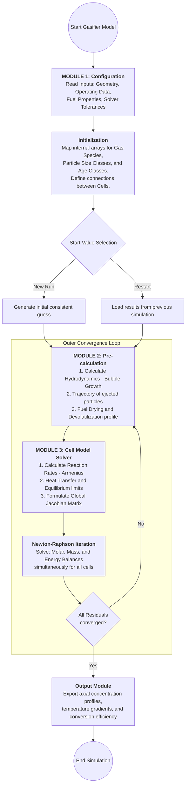
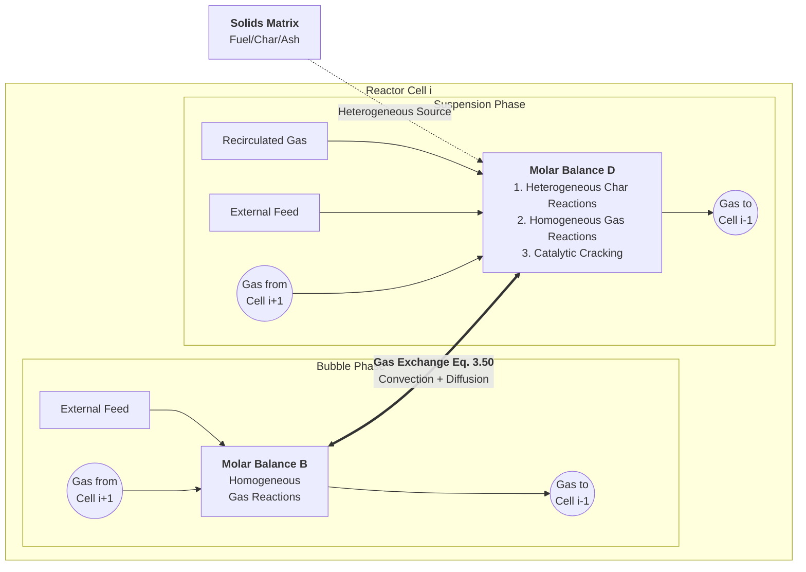

以下是根据你上传的 `BFB_TechSpec_v10.docx` 内容转换而成的 Markdown 格式文档。该文档保留了所有技术细节、方程编号、来源说明以及 Python 架构建议。

---

# 鼓泡流化床气化炉一维稳态动力学模型
## 模型重构完整技术说明书

* [cite_start]**主要来源**：Hamel & Krumm, Powder Technology 120 (2001) 105–112 [cite: 3]
* [cite_start]**补充来源**：Hamel (1999) 博士/技术报告（通过 AlphaXiv 提取） [cite: 4]
* **版本**：v11.0（新增 §5 Gibbs 自由焓最小化与反应动力学耦合框架完整说明，基于 Hamel 博士论文全文）

---

### 🆕 本次修订说明（v11.0）
本版本在 v8.0 基础上新增 **§5 Gibbs 自由焓最小化与反应动力学耦合求解框架**，内容来自 Hamel 博士论文全文精读。核心补充：
- Gibbs 平衡驱动力修正项（Eq. 5.45），防止气相组成违背热力学第二定律；
- 微量组分（$\text{H}_2\text{S}$、$\text{NH}_3$、$\text{COS}$）的 Gibbs 子程序处理流程；
- Newton-Raphson 迭代中动力学内循环与 Gibbs 子程序的层级调用关系（Bild 2.2）；
- 角色分工汇总表（动力学模型 vs. Gibbs (A1) 求解器）。

原版本（v8.0）修订内容保留：守恒方程（v3）+ 流体力学完整方程组（v4-v7），包括 Gleichung 3.50 ($K_{bd}$) 和 Gleichung 3.44 ($u_{br}$ 压力修正)，包括相间质量交换方程（含慢泡/快泡判别）、气相摩尔守恒、固相粒径类守恒、全局能量守恒，以及反应处理方式（收缩颗粒/核模型、Gibbs 自由焓校验）。

---

### 0. Hamel (1999) 程序结构与摩尔守恒逻辑（Bild 2.2 / 2.3）

以下为论文 **Bild 2.2（p. 17，程序结构）** 与 **Bild 2.3（p. 18，摩尔衡算）** 的 **Mermaid** 数字化版本（与根目录 `README.md` 中图示一致），可在 Mermaid Live Editor 或支持 Mermaid 的 IDE 中导出高清图。

#### Bild 2.2 — Program Structure



#### Bild 2.3 — Molar balances per cell (bubble vs suspension)



**实现提示**

1. **外层环**：Newton 收敛后需回到 **Vorabrechnung** 更新水力学与干燥/热解源项（温度依赖）→ 对应代码中 Vorabrechnung 与 `Reactor.solve` 外迭代（含 `global_nr` 双层结构）。
2. **Eq. 3.50**：$K_{bd}$ 相间交换在气泡相与悬浮相方程中为**配对源项**（见 §1.2 式 (1-1) 及下文守恒方程）。
3. **Jacobian**：论文 Fortran 使用块三对角结构；Python 中 `solver="global_nr"` 使用稀疏有限差分 Jacobian（见 `global_nr_solver.py`）。

---

### 1. 模型总体架构
[cite_start]**📖 来源**：Hamel & Krumm (2001) Section 2.1 + Hamel (1999) 技术报告 [cite: 8]

[cite_start]**模型类型**：一维 (1D) 稳态多相反应器模型，轴向离散为串联计算单元 (cells) [cite: 9][cite_start]。气化炉及辅助组件（旋风分离器、连接管道）全部离散为串联计算单元。每个 cell 按两相理论进一步划分为气泡相 (bubble phase) 和悬浮相/乳化相 (suspension/emulsion phase) [cite: 10]。

#### 1.1 相态划分（两相理论）
[cite_start]**📖 来源**：Hamel (1999) 技术报告，Section: Cell Model Phase Division [cite: 12]

| 相 | 描述 |
| :--- | :--- |
| **气泡相 (Bubble Phase)** | [cite_start]无固体颗粒。仅含气体，只计算均相气相反应 (homogeneous gas-phase reactions)。 [cite: 13] |
| **悬浮相 (Suspensionsphase / Emulsion Phase)** | [cite_start]含全部固体颗粒（燃料、炭、惰性床料）和大部分气体。同时计算均相反应与非均相气固反应 (heterogeneous reactions)。 [cite: 13] |

#### 1.2 相间气体交换方程
[cite_start]**📖 来源**：Hamel (1999) 技术报告，核心方程 [cite: 15]

组分 $j$ 在 cell $i$ 中的交换摩尔流率为：
[cite_start]$$\dot{N}_{ex,bd,j,i} = K_{bd,i} \cdot V_{b,i} \cdot (C_{j,b,i} - C_{j,d,i}) \quad (1-1)$$ [cite: 17]

[cite_start]**变量定义：** [cite: 18]
* $\dot{N}_{ex,bd,j,i}$ [mol/s]：从气泡相 (b) 到悬浮相 (d) 的组分 $j$ 的净交换摩尔流率。
* $K_{bd,i}$ [1/s]：整体相间气体传质系数。
* $V_{b,i}$ [m³]：cell $i$ 中气泡相总体积。
* $C_{j,b,i}$ [mol/m³]：气泡相中组分 $j$ 的摩尔浓度。

##### 1.2.1 慢泡与快泡的 $K_{bd}$ 计算判别
[cite_start]**📖 来源**：Hamel (1999)，基于气泡速度比 $\alpha_b$ 判别 [cite: 20]
[cite_start]$$\alpha_b = U_b / U_{mf} \quad (1-2)$$ [cite: 22]

| 条件 | 物理机制与 $K_{bd}$ 计算方式 |
| :--- | :--- |
| **$\alpha_b < 1$（慢泡）** | [cite_start]气体绕流气泡穿透悬浮相，相间交换率高。$K_{bd}$ 直接由扩散和对流两项构成（Davidson & Harrison 模型）。 [cite: 23] |
| **$\alpha_b > 1$（快泡）** | [cite_start]气泡外形成 Cloud-Zone，产生扩散屏障。$K_{bd}$ 需采用云区修正。 [cite: 23] |

---

### 2. 守恒方程体系
[cite_start]**🆕 内容说明**：本章方程完整来自 Hamel (1999) 技术报告 [cite: 26]。

#### 2.1 气相摩尔守恒方程
[cite_start]对每个 cell $i$，对两相分别建立稳态摩尔守恒方程（所有项之和等于零） [cite: 29]：

**2.1.1 悬浮相 (d) 气体摩尔守恒：**
[cite_start]$$0 = \dot{N}_{zu,d,j,i} + \dot{N}_{rez,d,j,i} + \dot{N}_{d,j,i+1} + \dot{N}_{r,d,j,i} - \dot{N}_{d,j,i} - \dot{N}_{ex,bd,j,i} \quad (2-1)$$ [cite: 31]

**2.1.2 气泡相 (b) 气体摩尔守恒：**
[cite_start]$$0 = \dot{N}_{zu,b,j,i} + \dot{N}_{rez,b,j,i} + \dot{N}_{b,j,i+1} + \dot{N}_{r,b,j,i} - \dot{N}_{b,j,i} + \dot{N}_{ex,bd,j,i} \quad (2-2)$$ [cite: 33]

[cite_start]*注：$\dot{N}_{ex,bd,j,i}$ 在悬浮相中为流出（-），在气泡相中为流入（+） [cite: 34]。*

#### 2.2 固相质量守恒方程（含粒径类）
[cite_start]对固体燃料类型 $j$、粒径类 $k$ 的质量守恒 [cite: 38]：
[cite_start]$$0 = \sum_k [ \dot{m}_{zu,j,k,i} + \dot{m}_{rez,j,k,i} - \dot{m}_{aus,j,k,i} - \dot{m}_{auf,j,k,i} - \dot{m}_{ab,j,k,i} + \dot{m}_{auf,j,k,i+1} + \dot{m}_{ab,j,k,i-1} + \dot{m}_{r,j,k,i} + \dot{m}_{left,j,k,i} - \dot{m}_{right,j,k,i} ] \quad (2-3)$$ [cite: 40]

* [cite_start]$\dot{m}_{left/right}$：因颗粒收缩或生长在不同粒径类 $k$ 之间迁移的质量流 [cite: 41, 42]。

#### 2.3 全局能量守恒方程
[cite_start]**假设**：同一 cell 内气体与固体处于热力学平衡（局部温度相等），因此能量守恒针对整个 cell 合并计算 [cite: 45]。
[cite_start]$$0 = \dot{H}_{zu,i} + \dot{H}_{rez,i} + \dot{H}_{auf,i+1} + \dot{H}_{ab,i-1} - \dot{H}_{auf,i} - \dot{H}_{ab,i} - \dot{H}_{aus,i} - \dot{Q}_{W,i} - \dot{Q}_{WU,i} \quad (2-4)$$ [cite: 46]

**总焓流计算：**
[cite_start]$$\dot{H}_i = \sum_{l=1}^{N_{phases}} \sum_{j=1}^{N_{gas}} \dot{N}_{l,j,i} \cdot h_{l,j} + \sum_{j=1}^{N_{fuel}} \sum_{k=1}^{N_{dp,j}} \dot{m}_{j,k,i} \cdot h_{j,k} + \dot{m}_s \cdot h_s \quad (2-5)$$ [cite: 50]
[cite_start]*注：焓值 $h$ 必须包含标准生成焓，使化学反应热自动体现在守恒中 [cite: 52]。*

---

### 3. 反应处理框架
[cite_start]化学反应通过源项 $\dot{N}_r$（气相）和 $\dot{m}_r$（固相）进入守恒方程 [cite: 55]。

#### 3.1 非均相固-气反应（炭气化/燃烧）
| 模型 | 说明 |
| :--- | :--- |
| **收缩颗粒模型 (SPM)** | [cite_start]用于炭燃烧 (R1)。假设颗粒直径随时间减小。 [cite: 58] |
| **收缩核模型 (SCM)** | [cite_start]用于慢速气化反应 (R4)。反应物气体向内扩散并在未反应核表面发生反应。 [cite: 58] |

**Arrhenius 速率常数形式：**
[cite_start]$$k(T) = A_0 \cdot \exp(-E_a / (R_{gas} \cdot T)) \quad (3-1)$$ [cite: 60]

#### 3.2 均相气相反应（R5–R11）
* [cite_start]采用动力学速率表达式，而非纯平衡计算 [cite: 66]。
* [cite_start]**Gibbs 自由焓校验**：计算结果不得超越热力学平衡极限 [cite: 67]。
* [cite_start]**R5 特殊处理**：CO 氧化反应在气泡相和悬浮相使用不同的动力学表达式 [cite: 68]。

---

### 4. 流体力学子模型 (Hydrodynamics)
#### 4.1 最小流化速度 $u_{mf}$
[cite_start]基于 Ergun 方程计算 $Re_{mf}$ [cite: 85, 89]：
[cite_start]$$Ar = \frac{150(1-\epsilon_{mf})}{\phi_s \epsilon_{mf}^3} Re_{mf} + \frac{1.75}{\phi_s \epsilon_{mf}^3} Re_{mf}^2 \quad (4-2)$$ [cite: 90]

#### 4.2 气泡动力学（Hilligardt 模型）
**气泡上升速度：**
[cite_start]$$u_b = \psi_b \cdot (u_0 - u_{mf}) + u_{b,i} \quad (4-4)$$ [cite: 99]
* [cite_start]$\psi_b$：气泡相互作用因子（工业分布板默认取 0.76） [cite: 102, 103]。

**气泡直径增长微分方程：**
[cite_start]$$\frac{dd_b}{dh} = \left[ \frac{2}{9\pi} \cdot \frac{\epsilon_b^{1/3}}{1 - \xi_b(6/\pi)^{1/3}\epsilon_b^{1/3}} \right] - \frac{d_b}{3 \lambda_b u_b} \quad (4-6)$$ [cite: 110]
* [cite_start]$\lambda_b$：气泡平均寿命（含加压修正） [cite: 118]。

#### 4.3 相间传质系数 $K_{bd}$
[cite_start]**实际实现：Sit & Grace 混合模型 (Gleichung 3.50)** [cite: 138, 141]
$$K_{bd} = \frac{3 u_{br}}{2 d_b} + \sqrt{\frac{144 D_g \epsilon_{mf} u_b}{\pi d_b^3}} \quad (4-12)$$
* [cite_start]**对流项压力修正**：$u_{br} = n_b \cdot u_d \cdot (P / P_0)^{-0.15}$ [cite: 147]。

---

### 6. 化学反应动力学网络（v8.0 完整版）
[cite_start]部分核心反应动力学来源 [cite: 223]：
* **R1 炭燃烧**：Hobbs et al. (1992) [cite_start][cite: 225]。
* [cite_start]**R4 Boudouard 反应**：Weeda (1995) [cite: 243][cite_start]，采用 Langmuir-Hinshelwood 机制 [cite: 244]。
* **R8 水煤气变换 (WGSR)**：Chen et al. (1987) [cite_start][cite: 254][cite_start]，含煤灰催化修正 [cite: 255]。

---

### 10. Python 架构建议
#### [cite_start]10.1 Cell 类核心方法 [cite: 320]
```python
class Cell:
    def __init__(self):
        self.T = 1200      # 温度 [K]
        self.P = 2500000   # 压力 [Pa]
        self.N_b = []      # 气泡相各组分摩尔流率 [mol/s]
        self.N_d = []      # 悬浮相各组分摩尔流率 [mol/s]
        self.m_solid = []  # 固体质量流率 [kg/s]

    def calc_hydrodynamics(self):   # 计算 K_bd, epsilon_b, u_b
    def calc_exchange(self):        # 计算相间气体交换 N_dot_ex
    def calc_gas_balance(self):     # 气相摩尔守恒方程
    def calc_solid_balance(self):   # 固相质量守恒（含粒径迁移）
    def calc_energy_balance(self):  # 全局能量守恒
    def calc_reactions(self):       # 反应源项计算
```

#### [cite_start]10.2 模块目录结构 [cite: 322]
```text
gasifier_1d/
  core/
    cell.py              # Cell 类实现
    species.py           # 物性与热力学属性
  physics/
    hydrodynamics.py     # 流体力学模型与压力修正
    entrainment.py       # 自由板区轨迹
  kinetics/
    drying.py            # 干燥子模型
    devolatilization.py  # DAEM 热解模型
    char_reactions.py    # R1-R4 异相反应
    gas_reactions.py     # R5-R11 均相反应
```
---

### 5. Gibbs 自由焓最小化与反应动力学耦合框架
**📖 来源**：Hamel 博士论文全文，重点章节：Bild 2.2 (p.17)、Eq. 5.45 (p.94)、附录 A1

> **核心思想**：动力学模型决定碳转化"走多快"，Gibbs 求解器决定气体混合物的"最终形态"。两者通过 Newton-Raphson 迭代耦合，实现既符合动力学速率又不违背热力学极限的计算结果。

---

#### 5.1 热力学可行边界的建立

**问题**：纯动力学方程本身不知道何时到达平衡，可能计算出违背热力学第二定律的气相组成。

**解决方案**：Gibbs 求解器为主要气相反应（如水煤气变换反应 WGSR、甲烷化反应）提供平衡常数 $K_{eq}$（或平衡浓度 $y_{eq,j}$），作为动力学速率的上限约束。

**耦合方程（Eq. 5.45，p. 94）**：

$$R_{CO,net} = R_{CO,kinetic} \cdot \left(1 - \frac{Q_p}{K_{eq}}\right) \quad (5-1)$$

**变量定义：**
- $R_{CO,net}$ [mol/(m³·s)]：CO 的净反应速率（实际执行速率）。
- $R_{CO,kinetic}$ [mol/(m³·s)]：由 Arrhenius 方程计算的纯动力学速率（不含热力学约束）。
- $Q_p$ [–]：当前气相组成对应的反应商（Reaction Quotient），由当前各组分分压计算。
- $K_{eq}$ [–]：由 Gibbs 求解器提供的热力学平衡常数（仅为温度和压力的函数）。

**物理含义：**

| $Q_p / K_{eq}$ 比值 | 驱动力项 | 物理意义 |
| :---: | :---: | :--- |
| $\approx 0$（远离平衡） | $\approx 1$ | 动力学主导，以全速率反应 |
| $\to 1$（趋近平衡） | $\to 0$ | 反应自动减速，趋于停止 |
| $> 1$（超出平衡，逆向）| $< 0$ | 反应反向进行，向平衡回归 |

> **注意**：该修正项确保无论温度多高，气相组成都不会越过热力学平衡极限。

---

#### 5.2 微量组分的 Gibbs 子程序处理

**背景**：对于 $\text{H}_2\text{S}$、$\text{NH}_3$、$\text{COS}$ 等微量含硫/含氮组分，在复杂流化床中难以获取可靠的动力学数据。Hamel 的处理假设为：这些组分在实际停留时间内**足够快地达到热力学平衡**。

**处理流程（每个 cell 迭代内）：**

```
步骤 1：动力学计算（主反应 R1–R11）
  ├─ 求解 C、CO、CO₂、H₂、H₂O、CH₄ 等主要组分的摩尔守恒
  └─ 更新 cell 温度 T 和主组分摩尔流率

步骤 2：元素守恒核算
  ├─ 统计该 cell 内释放的总 S 原子量（来自燃料热解/炭反应）
  └─ 统计总 N 原子量（来自燃料热解/炭反应）

步骤 3：Gibbs 子程序（仅针对微量组分）
  输入：当前 T, P，以及可用 S、N、H、O 原子量
  目标：在候选组分集合 {H₂S, SO₂, COS, NH₃, HCN, NO} 中
        最小化吉布斯自由能 G = Σ nⱼ·μⱼ(T,P)
  输出：各微量组分的平衡摩尔分布

步骤 4：反馈更新
  └─ 将微量组分结果写回 cell 摩尔守恒，用于下一次 Newton-Raphson 迭代
```

**Gibbs 最小化形式（附录 A1）：**

$$\min G = \sum_{j} n_j \left[ \Delta_f G_j^\circ(T) + R_{gas} T \ln\left(\frac{n_j}{n_{tot}} \cdot \frac{P}{P^\circ}\right) \right] \quad (5-2)$$

约束条件：
$$\sum_j a_{e,j} \cdot n_j = b_e \quad \forall \text{ 元素 } e \quad (5-3)$$
$$n_j \geq 0 \quad (5-4)$$

其中 $a_{e,j}$ 为组分 $j$ 中元素 $e$ 的原子数，$b_e$ 为该元素的总原子量（守恒量）。

---

#### 5.3 集成求解层级（Newton-Raphson 迭代框架）

**📖 来源**：Bild 2.2 (p. 17)，Hamel 博士论文

```
┌─────────────────────────────────────────────────────┐
│              Newton-Raphson 外层迭代                  │
│  收敛判据：全局摩尔守恒残差 < ε_tol                    │
│                                                     │
│  ┌──────────────────────────────────────────────┐   │
│  │          内层循环：动力学计算                   │   │
│  │                                              │   │
│  │  For each cell i:                            │   │
│  │    1. 计算流体力学量 (u_b, K_bd, ε_b)         │   │
│  │    2. 计算相间交换 Ṅ_ex,bd                    │   │
│  │    3. 计算异相反应速率 (R1–R4, SPM/SCM)       │   │
│  │    4. 计算均相反应速率 (R5–R11)               │   │
│  │       └─ 调用 Gibbs 子程序 →                 │   │
│  │          ├─ 获取 K_eq → 计算驱动力修正项       │   │
│  │          └─ 求解微量组分分布 (S, N)           │   │
│  │    5. 更新摩尔守恒残差                        │   │
│  └──────────────────────────────────────────────┘   │
│                                                     │
│  检查收敛 → 若未收敛，更新 Jacobian 并迭代             │
└─────────────────────────────────────────────────────┘
```

**关键设计原则：**
- Gibbs 子程序在每次迭代中被调用，而非仅在最终步骤调用，确保 $K_{eq}$ 随温度实时更新。
- 微量组分的 Gibbs 计算与主组分的动力学计算**解耦**（顺序而非联立求解），降低求解复杂度。
- 最终产品气组成：碳转化率由动力学决定，气相组成由动力学+热力学约束共同决定。

---

#### 5.4 动力学模型与 Gibbs 求解器角色分工汇总

| 特征 | 动力学模型 | Gibbs (A1) 求解器 |
| :--- | :--- | :--- |
| **关注对象** | 炭转化 ($C$)、$CO$、$H_2$、$CH_4$ | $H_2S$、$NH_3$、$SO_2$，以及平衡极限 |
| **计算依赖** | 时间（停留时间）+ 表面积（速率方程） | 状态量（$T, P$，元素原子量） |
| **约束来源** | Arrhenius 方程（动力学参数） | 吉布斯自由能最小化（热力学） |
| **核心贡献** | 决定**多少**碳被气化（转化率） | 决定气体混合物的**最终形态** |
| **适用时间尺度** | 慢反应（炭气化，秒级） | 快反应（气相平衡，毫秒级假设） |
| **在 Python 实现中** | `char_reactions.py` + `gas_reactions.py` | `thermodynamics.py`（新增模块建议） |

---

#### 5.5 当前 Python 仓库目录（与 §5.3 论文级 NR 框架对照）

以下反映 **`bfb-gasifier/src/`** 实际布局。热力学、动力学、干燥/热解已实现；**全炉联立求解**与 §5.3 示意图 **不等价**，详见 **§5.6**。

```text
src/
  core/
    cell.py              # Cell：守恒残差、calc_gibbs_correction 等
    reactor.py           # 多 cell 外循环（扫描迭代，非全局 NR）
    species.py
    composition.py       # 湿基↔干基换算等
    feed_inlet.py
    constants.py
  solvers/
    cell_solver.py       # 单 cell：scipy.optimize.fsolve
  physics/
    minimum_fluidization.py, bubble_dynamics.py, mass_transfer.py
    phase_fractions.py, freeboard.py
  kinetics/
    arrhenius.py, char_reactions.py, gas_reactions.py, tar_reactions.py
  thermal/
    drying.py            # Agarwal + CN
    devolatilization.py  # DAEM
  thermodynamics/
    equilibrium.py, gibbs_minimizer.py, minor_species.py
```

**`cell.py` 新增方法（对应耦合框架）：**

```python
class Cell:
    # ... 原有属性 ...

    def calc_gibbs_correction(self, reaction_id: str) -> float:
        """
        计算反应动力学速率的热力学驱动力修正项 (1 - Q_p/K_eq)。
        对应 Eq. 5.45 (Hamel 博士论文 p.94)。
        
        参数:
            reaction_id: 反应编号（如 'R8_WGSR', 'R9_methanation'）
        返回:
            driving_force: 驱动力因子 [0, 1]（或负值表示逆反应）
        """
        K_eq = self.equilibrium.get_K_eq(reaction_id, self.T, self.P)
        Q_p = self.calc_reaction_quotient(reaction_id)
        return 1.0 - Q_p / K_eq

    def calc_minor_species_gibbs(self) -> dict:
        """
        对微量含硫/含氮组分调用 Gibbs 最小化子程序。
        对应 Hamel 博士论文附录 A1 处理流程。
        
        返回:
            minor_species: {组分名: 摩尔流率 [mol/s]} 字典
        """
        # 步骤 1: 从动力学结果中提取可用 S, N 原子量
        S_atoms = self.get_element_release('S')
        N_atoms = self.get_element_release('N')
        
        # 步骤 2: 调用 Gibbs 最小化求解器
        return self.gibbs_minimizer.solve(
            T=self.T, P=self.P,
            elements={'S': S_atoms, 'N': N_atoms,
                      'H': self.H_available, 'O': self.O_available},
            candidates=['H2S', 'SO2', 'COS', 'NH3', 'HCN', 'NO']
        )
```

---

#### 5.6 Python 实现与 Hamel 程序 / Bild 2.2 的差异（必读）

| 论文章节 / 机制 | 论文程序（目标） | 本仓库当前实现 |
|----------------|------------------|----------------|
| Bild 2.2，§2.3 | **一次全局 Newton–Raphson**，未知量为**全炉向量**；**分块三对角 Jacobian** | **`Reactor.solve`**：自下而上 **Gauss–Seidel 扫描**，每格单独 **`fsolve`**；格间耦合不在同一次 Jacobian 中 |
| Vorabrechnung | 进入主迭代前的**预算**，生成化学自洽的 **x₀** | **无**；`_build_cells()` 初值为主观猜测 |
| 干燥 / DAEM | 预算阶段**固定产率**或单次计算，主迭代中作**已知源项** | **`_calc_drying_pyrolysis_gas_source`** 在每次 **`residuals()`** 中重算 CN+DAEM（代价高，且随 T 强非线性） |
| 循环返料 | Jacobian **Nebenelemente**，与床层**联立** | 扫描后在 **`solve` 外**显式更新 `N_rez`、`m_solid_zu`；需额外外迭代（焓温见 `T_rez_gas`） |
| Verbindungsmatrix | 旋风、连接管等为 **cell**；ξ 可 >1 | **仅线性床层 cell**；**无**拓扑矩阵；`H_freeboard=0` 时无自由板段 |

**结论**：§5.3 框图描述的是 **Hamel 离散求解策略**；本仓库是 **简化扫描式实现**，不能从文档上假定为同一数值算法。**详细论证与收敛判据讨论**见 **`docs/validation_gap_analysis.md` §0**。

---

### 11. Chapter 4 干燥与热解数学框架（Hamel 原文对齐）

**来源**：Hamel 论文 Chapter 4（pp. 50–69），Agarwal 干燥模型 + Anthony & Howard (1976) DAEM。

#### 11.1 干燥模型（Agarwal）

采用球形颗粒，外层为干壳，内核为含水区，蒸发前沿半径为 \(r_e\)，颗粒外半径为 \(r_0\)。

**温度场（Eq. 4.1）**：

\[
\frac{\partial T}{\partial t}
=
\frac{a}{r^2}
\frac{\partial}{\partial r}
\left(
r^2 \frac{\partial T}{\partial r}
\right),
\quad r_e \le r \le r_0
\]

**边界条件（Eq. 4.2–4.3）**：

- 表面 \(r=r_0\)
\[
\lambda_s \left.\frac{dT}{dr}\right|_{r=r_0}
=
\alpha (T_{ws}-T_s)
=
\dot q(t)
\]

- 蒸发前沿 \(r=r_e\)
\[
\lambda_s \left.\frac{dT}{dr}\right|_{r=r_e}
=
h_v' \, w_{0,tr} \, \rho_s \, \frac{dr_e}{dt}
\]

**修正蒸发焓（Eq. 4.4）**：

\[
h_v'
=
h_v
+
\left(c_w+\frac{c_s}{w_{0,tr}}\right)(T_e-T_0)
\]

**传热关联式（Eq. 4.9）**：

\[
Nu_p
=
2 + 1.2\,Re^{1/2}Pr^{1/3}
\]

#### 11.2 热解模型（DAEM）

**挥发分释放方程（Eq. 4.10）**：

\[
\frac{m_v^*-m_v}{m_v^*}
=
\int_0^\infty
\exp\!\left[
-k_0\int_0^t\exp\!\left(-\frac{E}{RT}\right)\,dt
\right]
f(E)\,dE
\]

**活化能分布（Eq. 4.11）**：

\[
f(E)
=
\frac{1}{\sigma_E\sqrt{2\pi}}
\exp\!\left[
-\frac{(E-E_0)^2}{2\sigma_E^2}
\right]
\]

**径向体积分（Eq. 4.12）**：

\[
\frac{\bar m_v^*-\bar m_v}{\bar m_v^*}
=
\frac{3}{R_0^3}
\int_0^{R_0}
\left[
\int_0^\infty (\cdots)\,f(E)\,dE
\right] r^2\,dr
\]

#### 11.3 Chapter 4 动力学常数（Table 4.1 / 4.2）

| 参数 | 单位 | Brown Coal | Wood |
|---|---:|---:|---:|
| 平均活化能 \(E_0\) | J/mol | 192000 | 67500 |
| 标准差 \(\sigma_E\) | J/mol | 40000 | 13500 |
| 指前因子 \(k_0\) | 1/s | \(1.67\times10^{13}\) | 2500 |
| 干密度 \(\rho_s\) | kg/m³ | 1250 | 500 |
| 比热 \(c_p\) | J/(kg·K) | 1256 | 1670 |
| 导热系数 \(\lambda_s\) | W/(m·K) | 由 \(a\) 推得 | 0.1256 |
| 热扩散率 \(a\) | m²/s | \(0.1\times10^{-6}\) | - |

#### 11.4 在当前代码中的映射

- `src/thermal/drying.py`
  - `corrected_evaporation_enthalpy()` 对应 Eq. 4.4
  - `nusselt_particle()` / `convective_htc_from_nusselt()` 对应 Eq. 4.9
  - `solve_drying_CN()` 提供 \(r_e(t)\) 与径向温度史
- `src/thermal/devolatilization.py`
  - `DAEM_PARAMS` 按 Table 4.1/4.2 配置（brown_coal / wood）
  - `daem_conversion_radial()` 对应 Eq. 4.12
- `src/core/cell.py`
  - `calc_reactions()` 内部已按“先干燥后热解”调用子模型
  - 挥发分采用 C/H/O 元素守恒分配到 CO/H2/CH4/TAR（必要时 CO2/H2O 兜底）

#### 11.5 计算步骤（实现约定）

1. 先用干燥模型推进蒸发前沿与干壳层厚度。  
2. 对已干壳层温度时间史执行 DAEM（径向体积分）。  
3. 按挥发分元素守恒计算热解产物分配并回写 Cell 源项。  
4. 与后续均相/异相反应、Gibbs 子程序在同一残差链中迭代。

#### 11.6 当前实现中的 TODO（与源码对齐）

为保持文档与代码一致，Chapter 4 相关仍待项如下：

- `ReactorConfig.O2_feed/H2O_feed/N2_feed` 仍有占位，需由 ER 与燃料分析统一反推；
- `Cell` 内 `mu_g,20` 仍为常数占位，建议改为混合气粘度模型；
- 固相粒径迁移 `m_left/m_right` 尚未实现，Eq.2-3 仍为简化形式；
- 干燥物性（\(\lambda,\rho,c_p\)）与 R9 参数仍需按工况标定；
- `test_table2_LU.py` 仍含自由板与蒸汽/氧比占位测试假设。

> 详细清单以 `docs/missing_parameters_summary.md` 的「脚本 TODO 对照清单」为准。

