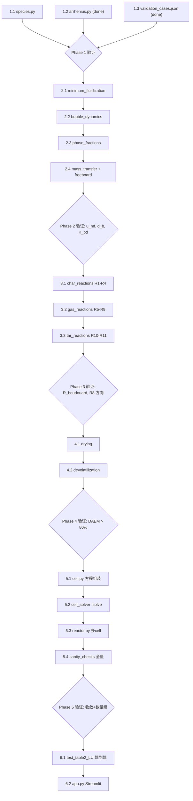

# BFB 气化炉一维模型完整执行计划

## 当前状态

已完成的工作：

- 目录结构已就位（与 [CLAUDE.md](docs/CLAUDE.md) 一致）
- [arrhenius.py](src/kinetics/arrhenius.py) 已实现三种工厂函数（含 np.clip 溢出保护）
- [cell.py](src/core/cell.py) 有 Cell 类骨架（6 个 NotImplementedError 方法）
- [validation_cases.json](data/validation_cases.json) 含 **`CASE_HTW_WESSELING_1`**（Table 2 LU / Table 7.1 Sim 1）；[test_cases.json](data/test_cases.json) 为兼容扁平快照
- [sanity_checks.py](tests/sanity_checks.py) 有框架和期望范围字典

尚未实现的核心逻辑：全部 src/ 模块的方程实现。

## 全局约束（贯穿所有 Phase）

- 全程 SI 单位，唯一例外 R8 内部换算 atm
- 速率常数只能调用 [arrhenius.py](src/kinetics/arrhenius.py)
- 物理常数集中管理（Rg=8.314, g=9.81, P0=101325, n_b=2.7）
- 每个函数 docstring 注明方程编号和文献来源
- 禁止 logging、设计模式、抽象基类

---

## Phase 1：基础层（无依赖）

### [1.1] species.py -- 气体热力学属性

**实现内容**：在 [src/core/species.py](src/core/species.py) 中实现：

- 气体组分枚举/列表：CO, CO2, H2, H2O, CH4, O2, N2, H2S, tar（需确认完整列表）
- NASA 7-coefficient 多项式：每种组分的 Cp(T)、H(T)、S(T)
- 标准生成焓 h_f298（守恒方程中的焓必须包含它）
- 固体组分：炭、灰、惰性床料的比热和焓

**PAUSE-1**：需要用户确认气体组分完整列表以及是否需要包含 tar 的等效热力学数据。NASA 多项式系数将从 GRI-Mech 或 Burcat 数据库获取，由 Agent 检索实现，不编造数值。

**验证**：

- 单元测试：`Cp_CO2(300K)` 约 37 J/(mol K)，`Cp_H2O(1000K)` 约 41 J/(mol K)
- H(T) 在 300K 和 1200K 之间单调递增
- h_f298(CO2) = -393.51 kJ/mol 等标准值比对

### [1.2] arrhenius.py -- 已完成

当前实现已包含三种工厂函数和 np.clip 保护。

**验证**（需补充单测）：

- `k_hobbs(k0=1e6, E=1e5, T=1000)` 输出量级合理
- `k_standard` 在 T->inf 时趋近 k0
- `k_jensen_r7` 在 T->0 时不溢出（clip 生效）

### [1.3] validation_cases.json -- 验证工况主数据

Table 2 LU 对应键 **`CASE_HTW_WESSELING_1`**（`test_cases.json` 中 `CASE_LU` 为等价扁平副本，以 `validation_cases.json` 为准）。

其余工况后续补充，不阻塞核心开发。

---

## Phase 2：流体力学

### [2.1] minimum_fluidization.py -- Ar, Re_mf, u_mf

**实现内容**：在 [src/physics/minimum_fluidization.py](src/physics/minimum_fluidization.py) 中：

- `calc_archimedes(rho_g, rho_s, d_p, mu_g)` -- Archimedes 数
- `calc_re_mf(Ar, eps_mf, phi_s)` -- 求解 Ergun 方程（二次公式或 scipy.optimize.brentq）
- `calc_u_mf(Re_mf, rho_g, mu_g, d_p)` -- 最小流化速度

**关键方程**：specs/02_hydrodynamics.md 中的 Ergun 方程。

**PAUSE-2**：需要确认 eps_mf 和 phi_s 的默认值（文献典型值：eps_mf=0.45, phi_s=0.8 对于褐煤）。

**验证（sanity_checks 门控）**：

- 输入：d_p=1mm, T=900K, P=2.5MPa, 褐煤
- 期望：u_mf 在 0.02--0.08 m/s 范围内
- 若不通过则停止，排查后再继续

### [2.2] bubble_dynamics.py -- u_b, d_b(h) ODE, 初始条件

**实现内容**：在 [src/physics/bubble_dynamics.py](src/physics/bubble_dynamics.py) 中：

- `bubble_rise_velocity(u0, u_mf, u_b0, psi_b=0.76)` -- Hilligardt 模型 Eq.4.4
- `classify_bubble_regime(u_b, u_mf)` -- 慢泡/快泡判别
- `bubble_diameter_ode(h, d_b, params)` -- d_b(h) 微分方程 Eq.4.6
- `integrate_bubble_diameter(u0, u_mf, d_b0, H_bed, ...)` -- scipy.integrate.solve_ivp 求解

**PAUSE-3**：需要以下参数（文献中有但 specs 未内联）：

- 气泡初始直径 d_b0 的计算公式或经验值
- 气泡平均寿命 lambda_b 的加压修正公式
- xi_b 参数的定义与取值

**验证**：

- d_b(H=5m) 在 0.05--0.3 m（P=2.5MPa, u0=0.3 m/s）
- d_b(h) 沿高度单调递增至稳定值

### [2.3] phase_fractions.py -- n_RZ, epsilon_d, epsilon_b

**实现内容**：在 [src/physics/phase_fractions.py](src/physics/phase_fractions.py) 中：

- `calc_n_rz(Re_s)` -- 按 Re_s 分段计算 Richardson-Zaki 指数（禁止常数 4.65）
- `calc_epsilon_b(u0, u_mf, u_b)` -- 气泡相体积分率
- `calc_epsilon_d(epsilon_b)` -- 悬浮相体积分率

**PAUSE-4**：需要 n_RZ 的分段公式和 Re_s 分界点。

**验证**：

- epsilon_b 在 0.01--0.5 之间（典型 BFB 工况）
- epsilon_b + epsilon_d 一致性

### [2.4] mass_transfer.py + freeboard.py

**mass_transfer.py**：

- `calc_kbd(u_br, d_b, D_g, eps_mf, u_b)` -- Sit & Grace Eq.4.12
- `calc_u_br(n_b, u_d, P, P0=101325)` -- 含 (P/P0)^{-0.15} 压力修正

**PAUSE-5**：需要气体混合扩散系数 D_g 的计算公式或典型值范围。

**freeboard.py**：

- `calc_beta_a(...)`, `calc_u_gb(u_b)`, `calc_cd_haider(Re_p, phi_s)`

**PAUSE-6**：需要 beta_A 衰减公式、Haider-Levenspiel C_D 关联式的完整系数。

**验证**：

- K_bd 在 1--15 s^{-1}（d_b=0.1m, P=2.5MPa, T=1000K）

### Phase 2 集成检查

运行 `tests/sanity_checks.py`，u_mf / d_b / K_bd 三项全部通过后方可进入 Phase 3。

---

## Phase 3：化学动力学

### [3.1] char_reactions.py -- R1(SPM), R2, R3, R4(Weeda/LH)

**实现内容**：在 [src/kinetics/char_reactions.py](src/kinetics/char_reactions.py) 中：

- `R1_char_combustion(T, P_O2, d_p, ...)` -- SPM + k_l 串联模型
- `R2_char_steam(T, P_H2O, d_p, ...)`
- `R3_char_hydro(T, P_H2, d_p, ...)`
- `R4_boudouard(T, P_CO2, P_CO, d_p, ...)` -- Weeda Langmuir-Hinshelwood

全部调用 `k_hobbs` 获取速率常数。

**PAUSE-7（关键）**：需要用户提供 R1-R4 的完整 Arrhenius 参数（k0, E），以及 R4 Weeda 的 LH 参数（K_1, K_2, K_3, 各自的 A0/E）。提醒：k_b/k_c 指数为正。

**验证**：

- R_boudouard(T=1073K, P_CO2=5e4 Pa) 约 1e-5 mol/(m^2 s)

### [3.2] gas_reactions.py -- R5(两相), R6, R7, R8, R9

**实现内容**：

- `R5_CO_oxidation_bubble(T, C_CO, C_O2)` -- 气泡相表达式
- `R5_CO_oxidation_suspension(T, C_CO, C_O2, C_H2O)` -- 悬浮相，含 C_H2O^0.5 项
- `R6_CH4_oxidation(T, ...)` -- k_standard
- `R7_steam_reforming(T, ...)` -- k_jensen_r7
- `R8_wgsr(T, P, y_CO, y_H2O, y_CO2, y_H2, ...)` -- 内部 P_atm = P/101325; 含煤灰催化; 含平衡常数方向校验
- Gibbs 自由焓校验：`check_equilibrium_limit(...)` -- 确保速率不超过平衡极限

**PAUSE-8**：需要 R5-R9 的完整参数（A0, E）、R8 Chen (1987) 的平衡常数表达式和煤灰催化因子。

**验证**：

- R8 WGSR 在 T=1073K, P=2.5MPa 下符号正确（朝平衡方向）

### [3.3] tar_reactions.py -- R10, R11

**实现内容**：

- `R10_tar_cracking(T, C_tar)` -- 一级（TODO 标注）
- `R11_tar_reforming(T, C_tar, C_H2O)` -- 一级（TODO 标注）

**PAUSE-9**：需要 R10/R11 的 A0, E 参数。

### Phase 3 集成检查

对每个反应在典型工况下计算速率，与文献值或数量级估计对比。全部通过后进入 Phase 4。

---

## Phase 4：干燥与热解

### [4.1] drying.py -- Agarwal / Crank-Nicolson FD

**实现内容**：在 [src/thermal/drying.py](src/thermal/drying.py) 中：

- 单颗粒一维球对称传热/传质方程的 Crank-Nicolson 有限差分离散
- 水分蒸发前沿跟踪
- 输出：干燥速率 [kg/s] 作为 cell 源项

**PAUSE-10**：需要 Agarwal 模型的原始方程组（PDE 形式、边界条件、物性参数：导热系数、汽化焓等）。

**验证**：

- 单颗粒在热气流中干燥时间的数量级合理

### [4.2] devolatilization.py -- DAEM + Gauss-Hermite

**实现内容**：

- 分布活化能模型 (DAEM)：`daem_rate(T_history, E0, sigma, A0, n_gh=20)`
- Gauss-Hermite 积分节点和权重（numpy 或 scipy 提供）
- 输出：挥发分释放率随时间/温度的变化

**PAUSE-11**：需要 DAEM 参数（E0, sigma, A0）以及褐煤热解产物的组成分配（tar/gas/char 比例）。

**验证**：

- 升温至 900 C，积分 100 s，挥发分释放率 > 80%

### Phase 4 集成检查

在典型温度历史下运行干燥 + 热解，确认：

- 干燥在 ~373K 附近完成
- 热解在 ~500-800K 区间释放大部分挥发分

---

## Phase 5：求解器与集成

### [5.1] cell.py -- 单 cell 守恒方程组装

**实现内容**：填充 [src/core/cell.py](src/core/cell.py) 中的 6 个方法：

- `calc_hydrodynamics()` 调用 physics/ 模块
- `calc_exchange()` 使用 K_bd 和浓度差计算 N_dot_ex
- `calc_gas_balance()` 组装悬浮相/气泡相摩尔守恒残差向量（N_dot_ex 同一张量、符号相反）
- `calc_solid_balance()` 向量化固相守恒（含粒径迁移，禁止 Python 嵌套循环）
- `calc_energy_balance()` 全局焓平衡
- `calc_reactions()` 聚合所有反应源项

**关键约束**：

- N_dot_ex 在两相方程中使用同一数组引用
- m_solid 使用 (n_fuels, n_sizes) 形状的 ndarray，粒径迁移用切片操作

**验证**：

- 构造一个已知解析解的简化 cell（如无反应、只有相间交换），验证残差为零

### [5.2] cell_solver.py -- scipy fsolve

**实现内容**：

- 将 cell 的守恒方程打包为 `residual_vector(x, cell)` 形式
- 调用 `scipy.optimize.fsolve` 求解
- 添加收敛检查和回退策略

**验证**：

- 简化工况（低温、少量反应）下收敛
- 残差范数 < 1e-8

### [5.3] reactor.py -- 多 cell 串联迭代

**实现内容**：在 [src/core/reactor.py](src/core/reactor.py) 中：

- 初始化 N 个 cell 的序列
- 进料条件注入第一个 cell
- 从底向顶逐 cell 求解（上游 cell 的输出作为下游的输入）
- 全局迭代（处理再循环流 recirculation）
- 收敛判据：各 cell 温度和组分变化 < 容差

**验证**：

- 5 cell 简化工况能跑通
- 温度沿轴向的趋势合理（进料端低、反应区高、出口降低）

### [5.4] sanity_checks.py -- 全面数量级验证

补全 [tests/sanity_checks.py](tests/sanity_checks.py)，调用已实现模块计算所有 6 项指标。

---

## Phase 6：端到端验证与界面

### [6.1] test_table2_LU.py

**实现内容**：

- 加载 CASE_LU 参数
- 运行完整 reactor 求解
- 比对实验数据：出口温度 ~900C（误差<10%）、碳转化率 ~85%（<10%）、CO ~0.25（<15%）

### [6.2] app.py -- Streamlit

最后实现的可视化界面，包括：

- 工况参数输入面板
- 轴向温度/组分分布图
- 出口气体组成对比表

---

## PAUSE 检查点汇总

以下是必须暂停并等待用户输入的节点（Agent 不可编造数据）：

| 编号       | Phase | 所需信息                            | 阻塞模块                    |
| -------- | ----- | ------------------------------- | ----------------------- |
| PAUSE-1  | 1.1   | 气体组分完整列表 + tar 热力学处理方式          | species.py              |
| PAUSE-2  | 2.1   | eps_mf, phi_s 默认值确认             | minimum_fluidization.py |
| PAUSE-3  | 2.2   | d_b0 公式, lambda_b 加压修正, xi_b 取值 | bubble_dynamics.py      |
| PAUSE-4  | 2.3   | n_RZ(Re_s) 分段公式与分界点             | phase_fractions.py      |
| PAUSE-5  | 2.4   | D_g 混合扩散系数公式                    | mass_transfer.py        |
| PAUSE-6  | 2.4   | beta_A 衰减公式, Haider C_D 系数      | freeboard.py            |
| PAUSE-7  | 3.1   | R1-R4 完整动力学参数                   | char_reactions.py       |
| PAUSE-8  | 3.2   | R5-R9 参数, R8 平衡常数, 煤灰催化因子       | gas_reactions.py        |
| PAUSE-9  | 3.3   | R10-R11 参数                      | tar_reactions.py        |
| PAUSE-10 | 4.1   | Agarwal PDE/边界条件/物性             | drying.py               |
| PAUSE-11 | 4.2   | DAEM 参数 (E0, sigma, A0) + 产物分配  | devolatilization.py     |

---

## 执行流程图

