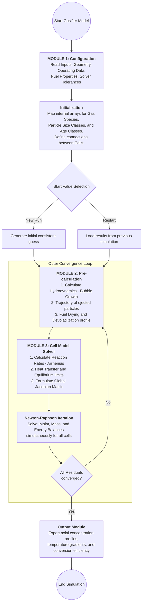
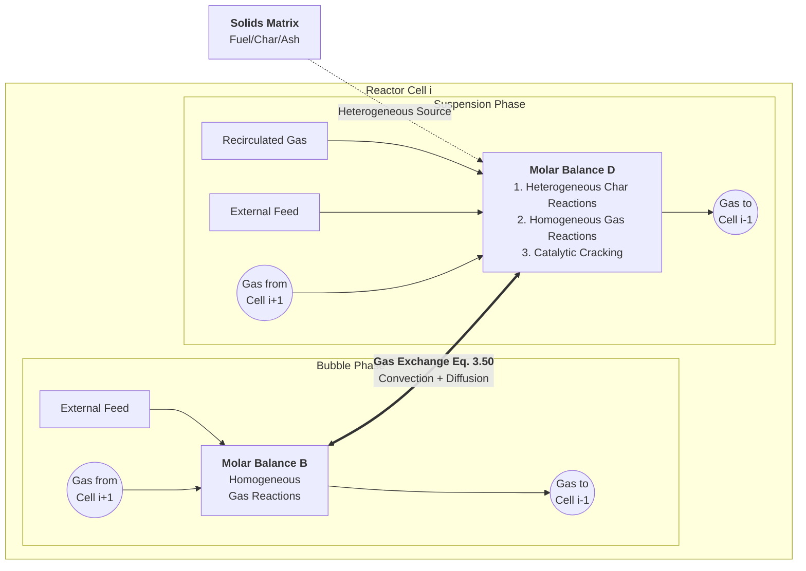

# Hamel (1999) Fortran 与当前 Python 实现对照说明

本文档与 [`hamel_dissertation_vs_python_architecture.svg`](hamel_dissertation_vs_python_architecture.svg) 一一对应，说明图中各条结论在**当前代码**下是否仍成立，并区分两种求解路径。

---

## 0. 论文图示：程序结构（Bild 2.2）与单格摩尔守恒（Bild 2.3）

以下 Mermaid 图由 Hamel (1999) **Bild 2.2（p. 17）**、**Bild 2.3（p. 18）** 数字化，与根目录 [`README.md`](../README.md) 及 [`BFB_TechSpec_v11.md`](BFB_TechSpec_v11.md) §0 一致，作为阅读下文「Module 1/2/3」时的**总览**。

### Bild 2.2 — Program structure（外层收敛与 Module 1→2→3）

### Bild 2.3 — Molar balances in cell $i$（气泡相 B / 悬浮相 D，Eq. 3.50）

**要点**

1. **Bild 2.2 反馈环**：Module 2（预计算）依赖温度；温度在 Module 3 / Newton 之后更新 → 下文 **§3 Vorabrechnung** 与 **`reactor._solve_global_nr`** 双层结构。
2. **Bild 2.3 双箭头**：**Eq. 3.50**（$K_{bd}$）在实现上为两相**相等相反**的交换项 → `cell.py` 中 $\dot{N}_{ex,bd}$。
3. **Newton 块**：论文强调全局联立；默认 **`gauss_seidel`** 路径为逐格 `fsolve`，**`global_nr`** 才接近图中「一次 Newton 联立全炉」。

---

## 1. 必读：两种 `Reactor.solve()` 路径

| 参数 | 含义 | 主要代码入口 |
|------|------|----------------|
| `solver="gauss_seidel"`（**默认**） | 外迭代 + 逐格 `fsolve`，**无**全局 Jacobian | `reactor._solve_gauss_seidel` → `cell_solver.solve_cell` |
| `solver="global_nr"` | 全局阻尼 Newton–Raphson（Hamel §2.3 思路）+ 双层 Vorabrechnung | `reactor._solve_global_nr` → `global_nr_solver.solve_global_nr` |

**图中右侧多数框格描述的是「旧版 / 默认 GS 路径」**；若图中写「MISSING」或「undamped」，在 **`global_nr` 路径下已有部分被填补**（见下文各节脚注）。

更完整的算法层讨论见 [`validation_gap_analysis.md`](validation_gap_analysis.md) §0。

---

## 2. Module 1：Konfiguration

| 图（Fortran） | 图（Python） | 当前代码结论 |
|---------------|--------------|--------------|
| 读取拓扑 + N_Gas × N_dp × **N_Alter** | `ReactorConfig`，无连接矩阵、无 **N_Alter** 维 | **仍成立**：配置为 `ReactorConfig` dataclass，无 Verbindungsmatrix，无颗粒年龄维。 |

---

## 3. Module 2：Vorabrechnung（预算）

| 图（Fortran） | 图（Python，原 SVG） | 当前代码结论 |
|---------------|----------------------|--------------|
| 预计算 u_b、d_b、VM yields → 化学一致 **x₀** | **MISSING**：硬编码 T≈1173 K、均匀 N、无 warm-up | **部分过时**： • **GS 路径**：每外迭代调用 `compute_vorabrechnung`（见 `reactor._solve_gauss_seidel`），**不是**「完全缺失」，但**非**论文「单次平均床温 + 一次 warm-up」的完整流程。 • **`global_nr` 路径**：`estimate_axial_T_profile` + `generate_initial_x0`（`vorabrechnung.py`）做 **Level 1 bootstrap**，更接近「化学一致初值」意图。 |

---

## 4. Module 3：Zellenmodell / 全局 Jacobian

| 图（Fortran） | 图（Python） | 当前代码结论 |
|---------------|--------------|--------------|
| 建立全局 **J**、分块三对角 + Nebenelemente、**单次**全局 NR | `Reactor.solve()` Gauss–Seidel：每格独立 `fsolve`、**无**格间 Jacobian、外层仅 **dT** 判据 | **对默认 GS 路径仍成立**。 **`global_nr` 路径**：`solve_global_nr` 构建**全局残差与阻尼步长**，与「全局 NR」一致；**格间耦合**与 Jacobian 稀疏结构是否与 Hamel 完全一致需单独核对实现细节（见 `global_nr_solver.py`）。 |

---

## 5. 阻尼 NR（Eq. 2.9）

| 图（Fortran） | 图（Python，原 SVG） | 当前代码结论 |
|---------------|----------------------|--------------|
| 阻尼 λ，‖F‖ 增大时减半；容差约 1e-4–1e-6 | **MISSING** — 无阻尼 `fsolve`、无步长控制、`tol_global=5 K` 过松等 | **仅对逐格 `fsolve` 仍近似成立**：`scipy.optimize.fsolve` 内部策略**≠**论文显式阻尼 λ。 **`global_nr` 路径**：实现**阻尼全局 NR**（步长减半等），图中「MISSING」**不适用于**该路径。 |

---

## 6. 再循环（Recirculation / Nebenelemente）

| 图（Fortran） | 图（Python） | 当前代码结论 |
|---------------|--------------|--------------|
| Jacobian 内 Sherman–Morrison 等，top→bottom 进入 **J** | 显式赋值：`N_rez_d`、`m_solid_zu` 等，**不在** Jacobian 内 | **仍成立**：循环在扫描后更新（如 `reactor._solve_gauss_seidel` 末尾），**未**作为全局联立未知量；`T_rez_gas` 与顶格对齐等逻辑仍存在，但拓扑上**非**论文「单次全局 NR 内闭合」。 |

---

## 7. 连接矩阵（Verbindungsmatrix）

| 图（Fortran） | 图（Python） | 当前代码结论 |
|---------------|--------------|--------------|
| 用户定义 cell 拓扑；含旋风、管道 cell | **MISSING**：硬编码顺序 0→N−1，无旋风/管道 cell | **仍成立**：仅线性床层序列，无旋风/连接管离散 cell。 |

---

## 8. Vorabrechnung：热解 / 挥发分（DAEM）

| 图（Fortran） | 图（Python，原 SVG） | 当前代码结论 |
|---------------|----------------------|--------------|
| 在**平均反应器温度**下**一次**算完，产率在 NR 前固定 | **每格每迭代**、每次 `residual()` 全算 CN+DAEM，极慢且与 NR 不一致 | **部分过时**：`Cell.compute_vorabrechnung()` 将干燥/热解源项**写入缓存**，内层 `fsolve` 的 `residuals()` **不再**每次完整重算 DAEM（见 `validation_gap_analysis.md` §0.3）。 仍与论文「**仅一次**、**平均 T**」**不等价**：缓存按**每外迭代**、**各格当前 T** 更新。 |

---

## 9. 固相流方向（图底部）

| 图（论文） | 图（代码） | 当前代码结论 |
|------------|------------|--------------|
| 逆流：自上而下，每格接收来自**上方**的固体 | `m_solid_in` 来自 `cell i+1`，但 **`cell[N-1].m_solid_in = 0` 恒成立** | **仍成立**：顶格无来自「上一格」的固体入口，`solve` 中显式 `self.cells[-1].m_solid_in[:] = 0.0`，与论文图示「顶格自上方来料」的表述需对照边界条件理解（进料通过 `fuel_feed` / `m_solid_zu` 等其它通道）。 |

---

## 10. SVG 图例与维护建议

- **绿色**：论文 Fortran 行为。
- **红色**：原图标注为「缺失」— 其中 **Vorabrechnung / 阻尼 NR / DAEM 每残差全算** 等条目，在 **`global_nr` 或 Vorabrechnung 缓存** 引入后已部分缓解，建议将 SVG 中对应框改为「Partial」或增加脚注指向本文档。
- **黄色**：部分实现（与 GS + 逐格 `fsolve` 强相关）。

若更新架构图，请同步修改本文件与 [`validation_gap_analysis.md`](validation_gap_analysis.md) 中 §0 的表述。

---

## 11. 相关代码索引

| 主题 | 路径 |
|------|------|
| 求解分发 | `src/core/reactor.py` — `solve`, `_solve_gauss_seidel`, `_solve_global_nr` |
| 逐格求解 | `src/solvers/cell_solver.py` |
| 全局 NR | `src/solvers/global_nr_solver.py` |
| 预算 / 初值 | `src/solvers/vorabrechnung.py` |
| Vorabrechnung 缓存、cell 残差 | `src/core/cell.py` — `compute_vorabrechnung` 等 |
| GS vs global_nr 对比测试 | `tests/test_lu_gs_vs_global_nr.py` |

---

*文档版本：与仓库 `bfb-gasifier` 当前实现对照整理；若实现变更，请更新本页与 SVG。*
