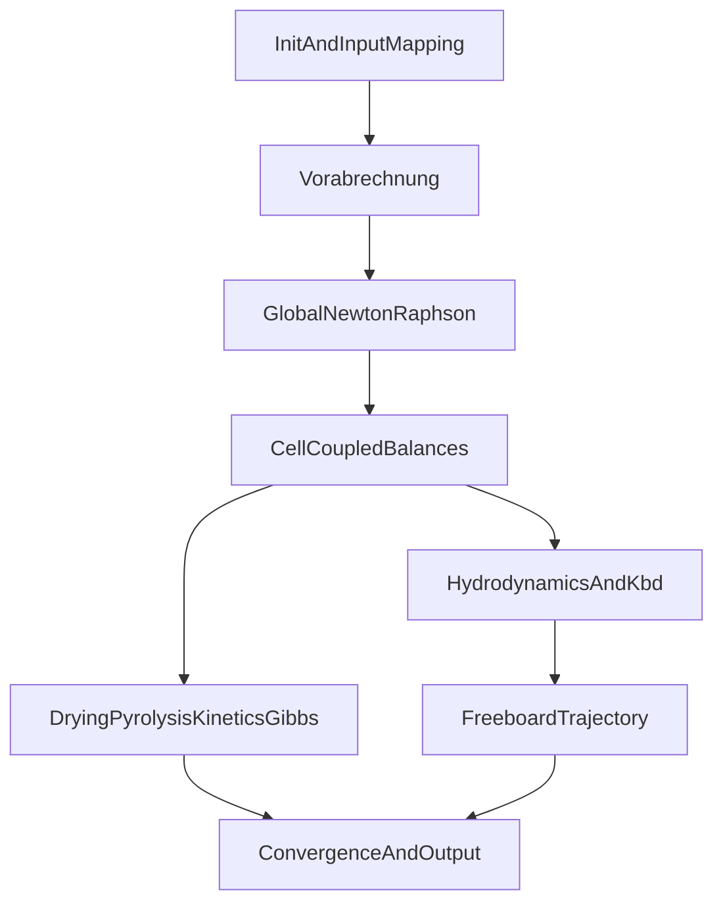

# Hamel 原版算法重建说明（Final v1，已锁定口径）

范围：基于项目内全量文档（含 `archive/`）倒序回溯，重建 Hamel 原版算法描述。  
文献优先级：Hamel (1999) > Hamel & Krumm (2001)。  
约束：仅写入有证据锚点的内容；无证据处明确标记“未证实”。

已锁定决策（用户确认）：
- 验收级别：**数学同构级**（连接矩阵 + 侧块 Jacobian + Fortran 结构尽量一致）。
- R10（Eq.5.59）压力口径：**以原文单位记号为准（当前从原文可读内容定位为 Pa 指数项）**。

---

## 0. 总体执行框架（按论文顺序，不按代码目录）

该框架仅表达**论文执行层级**。当前项目实现与此框架的差距，见各节“未证实/差异项”。

---

## 1) 初始化与预算（Vorabrechnung）

### 1.1 可直接确认（直接证据）
- 论文主线是“预计算（Vorabrechnung）→ 全局求解 → 外层检查”的层级（Bild 2.2 口径）。
- 项目中已有对应入口与链路：`src/solvers/vorabrechnung.py`、`src/solvers/global_nr_solver.py`、`src/core/reactor.py`。
- `global_nr_solver` 明确标注 Hamel 1999 §2.3 Eq.2.9 与 Bild 2.2 对应关系。

### 1.2 间接证据
- 源码中存在 outer/inner 分层和 thesis-mode 分支，体现“论文结构的工程映射”。

### 1.3 未证实/待锁定
- 是否已经达到“与原 Fortran 同构的一次性全炉预算”仍无闭合证据；目前只能确认“功能近似存在”。

### 来源清单
- 直接来源：原版论文 PDF（Bild 2.2；Kapitel 2.3；Eq.2.9）、`src/solvers/global_nr_solver.py`、`src/solvers/vorabrechnung.py`
- 间接来源：`src/core/reactor.py`

---

## 2) 全局联立求解（NR / Jacobian）

### 2.1 可直接确认（直接证据）
- 项目中存在全局阻尼 Newton-Raphson 求解器，标注对应 Hamel Eq.2.9（`src/solvers/global_nr_solver.py`）。
- 代码和文档明确“global NR”为主路径，GS 为 legacy/debug 路径（但旧文档仍有遗留描述）。

### 2.2 间接证据
- 源码显示结构化 Jacobian 与 side-element 处理路径，表明方向一致但并非逐式同构实现。

### 2.3 未证实/待锁定
- “论文分块三对角 + 返料侧块”的**严格离散同构**尚未证实完成。
- 连接矩阵（Verbindungsmatrix）相关未知量排序与线性化细节，项目文档未给出可直接核验的最终版说明。

### 来源清单
- 直接来源：原版论文 PDF（Eq.2.9 及 Kapitel 2.3 描述）、`src/solvers/global_nr_solver.py`
- 间接来源：`src/solvers/structured_jacobian.py`

---

## 3) 单元守恒与相间交换

### 3.1 可直接确认（直接证据）
- 两相交换项：\(\dot{N}_{ex,bd,j,i}=K_{bd,i}V_{b,i}(C_{j,b,i}-C_{j,d,i})\)（`specs/hamel_checked_algorithm_spec.md`）。
- 气相两方程（悬浮相/气泡相）结构明确；交换项符号成对出现。
- `src/core/cell_balances.py` 注释直接锚定 Eq.2.1/2.2/2.3/2.5/2.7。

### 3.2 间接证据
- `src/core/connectivity.py` 以 Eq.2.6 解释耦合口径；但属于工程实现说明，不是论文原文逐式解释。

### 3.3 未证实/待锁定
- 粒径类迁移项（\(m_{left}/m_{right}\)）与完整论文离散是否完全一致，项目文档未闭合。
- 固相能量与气相生成焓的严格闭合在 gap 文档中仍有风险提示，需进一步核验。

### 来源清单
- 直接来源：原版论文 PDF（Eq.2.1/Eq.2.2/Eq.2.7）、`src/core/cell_balances.py`
- 间接来源：`src/core/connectivity.py`

---

## 4) 水力学与自由板

### 4.1 可直接确认（直接证据）
- `u_mf`：Ergun/Ar-Re 关系（`specs/hamel_checked_algorithm_spec.md`）。
- 气泡速度与气泡链：Eq.3.14/3.15、Eq.3.41/3.42/3.43/3.44 在 `specs/hamel_checked_algorithm_spec.md` 与 `src/physics/bubble_dynamics.py`、`src/physics/mass_transfer.py` 有对应。
- `K_bd` 主式为 Eq.3.50（Sit & Grace 混合项），实现在 `src/physics/mass_transfer.py`。

### 4.2 间接证据
- 自由板轨迹在实现中同时存在 `analytical_wirsum` 与 `exact_hamel` 路径，后者仍为实验分支。
- `src/core/freeboard_segment.py` 注释引用 Eq.3.72/3.73/3.85/3.86/3.103/3.104/3.105。

### 4.3 未证实/待锁定
- Eq.3.43 已在原文 Chapter 3.1.3 连续方程链中定位到编号；但 OCR 质量限制下，仍建议保留“公式转写复核”步骤。
- `exact_hamel` 尚为实验路径，不能宣称已完全替代当前默认自由板实现。

### 来源清单
- 直接来源：原版论文 PDF（Eq.3.11/3.12/3.41/3.42/3.43/3.44/3.50）、`src/physics/bubble_dynamics.py`、`src/physics/mass_transfer.py`
- 间接来源：`src/core/freeboard_segment.py`

---

## 5) 干燥 / 热解

### 5.1 可直接确认（直接证据）
- 干燥核心式：Eq.4.2、Eq.4.4、Eq.4.6、Eq.4.9（`specs/hamel_checked_algorithm_spec.md`、`src/thermal/drying.py`）。
- DAEM：Eq.4.10–4.12，参数表 Table 4.1/4.2（`specs/hamel_checked_algorithm_spec.md`、`src/thermal/devolatilization.py`）。

### 5.2 间接证据
- 当前实现用 Crank-Nicolson 作为数值实现路径，文档明确这是对解析路径的工程替代。

### 5.3 未证实/待锁定
- 论文“预算阶段一次固定产率”与当前“外层刷新或 strict single-shot”并存；在同构级目标下，应以 single-shot 作为目标口径，但现有项目证据显示两条工程路径并存。

### 来源清单
- 直接来源：原版论文 PDF（Chapter 4；Eq.4.2/4.4/4.6/4.9/4.10-4.12）、`src/thermal/drying.py`、`src/thermal/devolatilization.py`
- 间接来源：无

---

## 6) 反应动力学与平衡约束（R1–R11 + Gibbs）

### 6.1 可直接确认（直接证据）
- 动力学主锚点：Eq.5.36、Eq.5.45–5.47、Eq.5.51、Eq.5.59、Table 5.4、Table 6.3（`specs/hamel_checked_algorithm_spec.md` 与 `src/kinetics/*.py` 注释）。
- 编号映射规则已在本文件与 `specs/hamel_checked_algorithm_spec.md` 固化为 thesis 编号优先。
- A1 相关求解器存在并给出方程编号注释（`src/thermodynamics/gibbs_minimizer.py`、`src/thermodynamics/gibbs_hamel_reduced.py`）。

### 6.2 间接证据
- 源码数据流显示 R8 平衡驱动力与 Gibbs 模块间存在接口耦合。

### 6.3 未证实/待锁定
- R10 口径按原文单位记号应为 Pa 指数项；当前实现存在“Pa→bar 转换”和 `k10` 缩放的工程折中，未达到同构复现。
- 当前 A1 实现与论文 Fortran 是否“同构”在审计文档中仍存在争议。

### 来源清单
- 直接来源：原版论文 PDF（Eq.5.36/5.45-5.47/5.51/5.59；Table 5.4/6.3；A1）、`src/kinetics/gas_reactions.py`、`src/kinetics/char_reactions.py`、`src/kinetics/tar_reactions.py`、`src/thermodynamics/gibbs_minimizer.py`
- 间接来源：`src/thermodynamics/equilibrium.py`

---

## 7) 收敛判据与输出定义

### 7.1 可直接确认（直接证据）
- 项目中存在 outer/inner 收敛链路与 freeboard/反应诊断输出字段（见 `src/solvers/global_nr_solver.py` 与 `src/core/freeboard_segment.py`）。

### 7.2 间接证据
- 源码中收敛控制与论文“全局残差”口径不完全同构，属于工程化收敛策略。

### 7.3 未证实/待锁定
- 是否已达到“论文定义的全局残差范数门槛等价”缺少统一定稿说明。

### 来源清单
- 直接来源：`src/solvers/global_nr_solver.py`、`src/core/freeboard_segment.py`
- 间接来源：原版论文 PDF（Kapitel 2/3/8）

---

## 8) 当前可下的结论（不超证据）

1. 项目已具备“按 Hamel 结构重建”的核心骨架：global NR、守恒方程、主要水力学链、Chapter 4 干燥热解、R1-R11 反应网络、Gibbs 相关模块。  
2. 在“数学同构级”目标下，仍不能宣称“完全重现 Hamel 原版算法”：连接矩阵同构、Jacobian 侧块同构、A1 同构性、部分自由板分支仍存在待闭合证据。  
3. R10 按原文单位记号应采用 Pa 口径；当前代码口径与原文存在偏差，需单独整改后方可宣称同构。  
4. 本稿已转为“可追溯 Final v1（口径锁定版）”，剩余项全部以“未闭合证据”显式保留。

---

## 9) 与本稿配套的索引与矩阵

- 时间回溯索引：`docs/hamel_doc_trace_index_latest_to_earliest.md`
- 证据矩阵：`docs/hamel_evidence_matrix.md`
- 同构级落地清单：`docs/hamel_isomorphic_gap_implementation_checklist.md`
