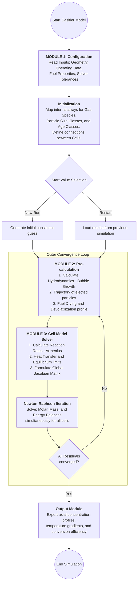
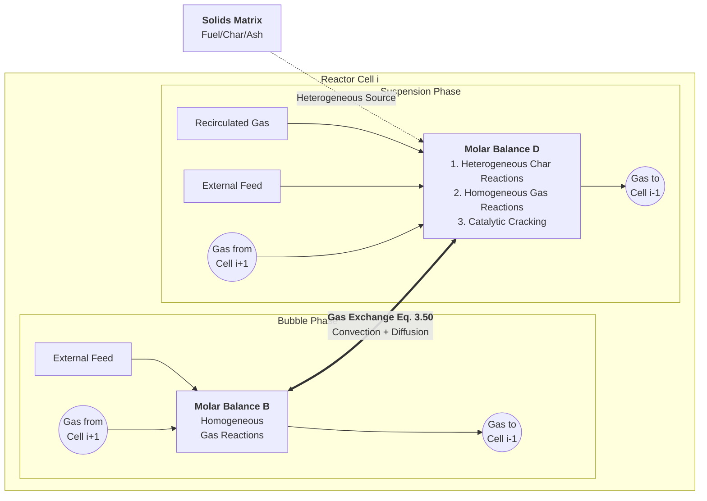

以下是根据你上传的 `BFB_TechSpec_v10.docx` 内容转换而成的 Markdown 格式文档。该文档保留了所有技术细节、方程编号、来源说明以及 Python 架构建议。

---

# 鼓泡流化床气化炉一维稳态动力学模型
## 模型重构完整技术说明书

* [cite_start]**主要来源**：Hamel & Krumm, Powder Technology 120 (2001) 105–112 [cite: 3]
* [cite_start]**补充来源**：Hamel (1999) 博士/技术报告（通过 AlphaXiv 提取） [cite: 4]
* [cite_start]**版本**：v8.0（干燥/热解完整参数 + 化学动力学 Table 5.2/6.3 全部补全） [cite: 5]

---

### Hamel (1999) 程序结构与摩尔守恒逻辑（Bild 2.2 / 2.3）

下列 Mermaid 图与根目录 [`README.md`](../README.md) 中「Hamel 原文图示」节一致，便于在技术说明书中一并归档。图源：论文 **p. 17（Bild 2.2 程序结构）**、**p. 18（Bild 2.3 摩尔守恒）**。

**Bild 2.2 — 模块 1→2→3 与外层收敛环**



**Bild 2.3 — Cell $i$ 内气泡相 / 悬浮相摩尔衡算与 Eq. 3.50 交换**



**要点**：(1) Module 2 与 Module 3 之间的**外层迭代**因热解/干燥依赖温度；(2) Eq. 3.50 在实现上为两相**源汇配对**；(3) 全局 NR 与块三对角 Jacobian 的对应关系见 `docs/hamel_dissertation_vs_python_architecture.md` 与 `src/solvers/global_nr_solver.py`。

---

### 🆕 本次修订说明
[cite_start]本版本（v7.0）已补全内容：守恒方程（v3）+ 流体力学完整方程组（v4-v7），包括 Gleichung 3.50 ($K_{bd}$) 和 Gleichung 3.44 ($u_{br}$ 压力修正)，包括相间质量交换方程（含慢泡/快泡判别）、气相摩尔守恒、固相粒径类守恒、全局能量守恒，以及反应处理方式（收缩颗粒/核模型、Gibbs 自由焓校验）。 [cite: 6]

---

### 1. 模型总体架构
[cite_start]**📖 来源**：Hamel & Krumm (2001) Section 2.1 + Hamel (1999) 技术报告 [cite: 8]

[cite_start]**模型类型**：一维 (1D) 稳态多相反应器模型，轴向离散为串联计算单元 (cells) [cite: 9][cite_start]。气化炉及辅助组件（旋风分离器、连接管道）全部离散为串联计算单元。每个 cell 按两相理论进一步划分为气泡相 (bubble phase) 和悬浮相/乳化相 (suspension/emulsion phase) [cite: 10]。

#### 1.1 相态划分（两相理论）
[cite_start]**📖 来源**：Hamel (1999) 技术报告，Section: Cell Model Phase Division [cite: 12]

| 相 | 描述 |
| :--- | :--- |
| **气泡相 (Bubble Phase)** | [cite_start]无固体颗粒。仅含气体，只计算均相气相反应 (homogeneous gas-phase reactions)。 [cite: 13] |
| **悬浮相 (Suspensionsphase / Emulsion Phase)** | [cite_start]含全部固体颗粒（燃料、炭、惰性床料）和大部分气体。同时计算均相反应与非均相气固反应 (heterogeneous reactions)。 [cite: 13] |

#### 1.2 相间气体交换方程
[cite_start]**📖 来源**：Hamel (1999) 技术报告，核心方程 [cite: 15]

组分 $j$ 在 cell $i$ 中的交换摩尔流率为：
[cite_start]$$\dot{N}_{ex,bd,j,i} = K_{bd,i} \cdot V_{b,i} \cdot (C_{j,b,i} - C_{j,d,i}) \quad (1-1)$$ [cite: 17]

[cite_start]**变量定义：** [cite: 18]
* $\dot{N}_{ex,bd,j,i}$ [mol/s]：从气泡相 (b) 到悬浮相 (d) 的组分 $j$ 的净交换摩尔流率。
* $K_{bd,i}$ [1/s]：整体相间气体传质系数。
* $V_{b,i}$ [m³]：cell $i$ 中气泡相总体积。
* $C_{j,b,i}$ [mol/m³]：气泡相中组分 $j$ 的摩尔浓度。

##### 1.2.1 慢泡与快泡的 $K_{bd}$ 计算判别
[cite_start]**📖 来源**：Hamel (1999)，基于气泡速度比 $\alpha_b$ 判别 [cite: 20]
[cite_start]$$\alpha_b = U_b / U_{mf} \quad (1-2)$$ [cite: 22]

| 条件 | 物理机制与 $K_{bd}$ 计算方式 |
| :--- | :--- |
| **$\alpha_b < 1$（慢泡）** | [cite_start]气体绕流气泡穿透悬浮相，相间交换率高。$K_{bd}$ 直接由扩散和对流两项构成（Davidson & Harrison 模型）。 [cite: 23] |
| **$\alpha_b > 1$（快泡）** | [cite_start]气泡外形成 Cloud-Zone，产生扩散屏障。$K_{bd}$ 需采用云区修正。 [cite: 23] |

---

### 2. 守恒方程体系
[cite_start]**🆕 内容说明**：本章方程完整来自 Hamel (1999) 技术报告 [cite: 26]。

#### 2.1 气相摩尔守恒方程
[cite_start]对每个 cell $i$，对两相分别建立稳态摩尔守恒方程（所有项之和等于零） [cite: 29]：

**2.1.1 悬浮相 (d) 气体摩尔守恒：**
[cite_start]$$0 = \dot{N}_{zu,d,j,i} + \dot{N}_{rez,d,j,i} + \dot{N}_{d,j,i+1} + \dot{N}_{r,d,j,i} - \dot{N}_{d,j,i} - \dot{N}_{ex,bd,j,i} \quad (2-1)$$ [cite: 31]

**2.1.2 气泡相 (b) 气体摩尔守恒：**
[cite_start]$$0 = \dot{N}_{zu,b,j,i} + \dot{N}_{rez,b,j,i} + \dot{N}_{b,j,i+1} + \dot{N}_{r,b,j,i} - \dot{N}_{b,j,i} + \dot{N}_{ex,bd,j,i} \quad (2-2)$$ [cite: 33]

[cite_start]*注：$\dot{N}_{ex,bd,j,i}$ 在悬浮相中为流出（-），在气泡相中为流入（+） [cite: 34]。*

#### 2.2 固相质量守恒方程（含粒径类）
[cite_start]对固体燃料类型 $j$、粒径类 $k$ 的质量守恒 [cite: 38]：
[cite_start]$$0 = \sum_k [ \dot{m}_{zu,j,k,i} + \dot{m}_{rez,j,k,i} - \dot{m}_{aus,j,k,i} - \dot{m}_{auf,j,k,i} - \dot{m}_{ab,j,k,i} + \dot{m}_{auf,j,k,i+1} + \dot{m}_{ab,j,k,i-1} + \dot{m}_{r,j,k,i} + \dot{m}_{left,j,k,i} - \dot{m}_{right,j,k,i} ] \quad (2-3)$$ [cite: 40]

* [cite_start]$\dot{m}_{left/right}$：因颗粒收缩或生长在不同粒径类 $k$ 之间迁移的质量流 [cite: 41, 42]。

#### 2.3 全局能量守恒方程
[cite_start]**假设**：同一 cell 内气体与固体处于热力学平衡（局部温度相等），因此能量守恒针对整个 cell 合并计算 [cite: 45]。
[cite_start]$$0 = \dot{H}_{zu,i} + \dot{H}_{rez,i} + \dot{H}_{auf,i+1} + \dot{H}_{ab,i-1} - \dot{H}_{auf,i} - \dot{H}_{ab,i} - \dot{H}_{aus,i} - \dot{Q}_{W,i} - \dot{Q}_{WU,i} \quad (2-4)$$ [cite: 46]

**总焓流计算：**
[cite_start]$$\dot{H}_i = \sum_{l=1}^{N_{phases}} \sum_{j=1}^{N_{gas}} \dot{N}_{l,j,i} \cdot h_{l,j} + \sum_{j=1}^{N_{fuel}} \sum_{k=1}^{N_{dp,j}} \dot{m}_{j,k,i} \cdot h_{j,k} + \dot{m}_s \cdot h_s \quad (2-5)$$ [cite: 50]
[cite_start]*注：焓值 $h$ 必须包含标准生成焓，使化学反应热自动体现在守恒中 [cite: 52]。*

---

### 3. 反应处理框架
[cite_start]化学反应通过源项 $\dot{N}_r$（气相）和 $\dot{m}_r$（固相）进入守恒方程 [cite: 55]。

#### 3.1 非均相固-气反应（炭气化/燃烧）
| 模型 | 说明 |
| :--- | :--- |
| **收缩颗粒模型 (SPM)** | [cite_start]用于炭燃烧 (R1)。假设颗粒直径随时间减小。 [cite: 58] |
| **收缩核模型 (SCM)** | [cite_start]用于慢速气化反应 (R4)。反应物气体向内扩散并在未反应核表面发生反应。 [cite: 58] |

**Arrhenius 速率常数形式：**
[cite_start]$$k(T) = A_0 \cdot \exp(-E_a / (R_{gas} \cdot T)) \quad (3-1)$$ [cite: 60]

#### 3.2 均相气相反应（R5–R11）
* [cite_start]采用动力学速率表达式，而非纯平衡计算 [cite: 66]。
* [cite_start]**Gibbs 自由焓校验**：计算结果不得超越热力学平衡极限 [cite: 67]。
* [cite_start]**R5 特殊处理**：CO 氧化反应在气泡相和悬浮相使用不同的动力学表达式 [cite: 68]。

---

### 4. 流体力学子模型 (Hydrodynamics)
#### 4.1 最小流化速度 $u_{mf}$
[cite_start]基于 Ergun 方程计算 $Re_{mf}$ [cite: 85, 89]：
[cite_start]$$Ar = \frac{150(1-\epsilon_{mf})}{\phi_s \epsilon_{mf}^3} Re_{mf} + \frac{1.75}{\phi_s \epsilon_{mf}^3} Re_{mf}^2 \quad (4-2)$$ [cite: 90]

#### 4.2 气泡动力学（Hilligardt 模型）
**气泡上升速度：**
[cite_start]$$u_b = \psi_b \cdot (u_0 - u_{mf}) + u_{b,i} \quad (4-4)$$ [cite: 99]
* [cite_start]$\psi_b$：气泡相互作用因子（工业分布板默认取 0.76） [cite: 102, 103]。

**气泡直径增长微分方程：**
[cite_start]$$\frac{dd_b}{dh} = \left[ \frac{2}{9\pi} \cdot \frac{\epsilon_b^{1/3}}{1 - \xi_b(6/\pi)^{1/3}\epsilon_b^{1/3}} \right] - \frac{d_b}{3 \lambda_b u_b} \quad (4-6)$$ [cite: 110]
* [cite_start]$\lambda_b$：气泡平均寿命（含加压修正） [cite: 118]。

#### 4.3 相间传质系数 $K_{bd}$
[cite_start]**实际实现：Sit & Grace 混合模型 (Gleichung 3.50)** [cite: 138, 141]
$$K_{bd} = \frac{3 u_{br}}{2 d_b} + \sqrt{\frac{144 D_g \epsilon_{mf} u_b}{\pi d_b^3}} \quad (4-12)$$
* [cite_start]**对流项压力修正**：$u_{br} = n_b \cdot u_d \cdot (P / P_0)^{-0.15}$ [cite: 147]。

---

### 6. 化学反应动力学网络（v8.0 完整版）
[cite_start]部分核心反应动力学来源 [cite: 223]：
* **R1 炭燃烧**：Hobbs et al. (1992) [cite_start][cite: 225]。
* [cite_start]**R4 Boudouard 反应**：Weeda (1995) [cite: 243][cite_start]，采用 Langmuir-Hinshelwood 机制 [cite: 244]。
* **R8 水煤气变换 (WGSR)**：Chen et al. (1987) [cite_start][cite: 254][cite_start]，含煤灰催化修正 [cite: 255]。

---

### 10. Python 架构建议
#### [cite_start]10.1 Cell 类核心方法 [cite: 320]
```python
class Cell:
    def __init__(self):
        self.T = 1200      # 温度 [K]
        self.P = 2500000   # 压力 [Pa]
        self.N_b = []      # 气泡相各组分摩尔流率 [mol/s]
        self.N_d = []      # 悬浮相各组分摩尔流率 [mol/s]
        self.m_solid = []  # 固体质量流率 [kg/s]

    def calc_hydrodynamics(self):   # 计算 K_bd, epsilon_b, u_b
    def calc_exchange(self):        # 计算相间气体交换 N_dot_ex
    def calc_gas_balance(self):     # 气相摩尔守恒方程
    def calc_solid_balance(self):   # 固相质量守恒（含粒径迁移）
    def calc_energy_balance(self):  # 全局能量守恒
    def calc_reactions(self):       # 反应源项计算
```

#### [cite_start]10.2 模块目录结构 [cite: 322]
```text
gasifier_1d/
  core/
    cell.py              # Cell 类实现
    species.py           # 物性与热力学属性
  physics/
    hydrodynamics.py     # 流体力学模型与压力修正
    entrainment.py       # 自由板区轨迹
  kinetics/
    drying.py            # 干燥子模型
    devolatilization.py  # DAEM 热解模型
    char_reactions.py    # R1-R4 异相反应
    gas_reactions.py     # R5-R11 均相反应
```

---

### 11. Chapter 4（干燥与热解）对齐说明

为与 Hamel 论文 Chapter 4（pp.50–69）一致，当前实现采用如下约定：

1. 干燥使用 Agarwal 框架（Eq.4.1–4.4、4.9），数值上用 Crank-Nicolson 有限差分求温度场与蒸发前沿；
2. 热解使用 DAEM（Eq.4.10–4.12），并支持径向体积分（壳层温度梯度）；
3. DAEM 参数优先采用 Table 4.1/4.2（Brown coal: \(E_0=192000\), \(\sigma=40000\), \(k_0=1.67\times10^{13}\)；Wood: \(E_0=67500\), \(\sigma=13500\), \(k_0=2500\)）；
4. Cell 源项链执行顺序为“先干燥后热解”，并按 C/H/O 元素守恒将挥发分分配到 CO/H2/CH4/TAR（必要时 CO2/H2O 兜底）。

> 以 `docs/BFB_TechSpec_v11.md` 为权威版本；本文件保留为历史兼容说明。

---

### 12. 实现与论文程序的差异（避免误读）

`techspec` / 上文 **§1 总体架构** 描述的是 **Hamel 论文中的模型与离散意图**（含旋风/连接管 cell、全局 NR 等）。**本仓库 Python 代码** 为 **Gauss–Seidel 式多 cell 扫描 + 单 cell `fsolve`**，**无 Vorabrechnung、无 Verbindungsmatrix**，与论文 Fortran 求解器 **不等价**。

- **详细对照**：`docs/validation_gap_analysis.md` **§0**
- **v11 技术说明书中 §5.5–§5.6** 已列出当前 `src/` 目录与 **Bild 2.2** 的差异